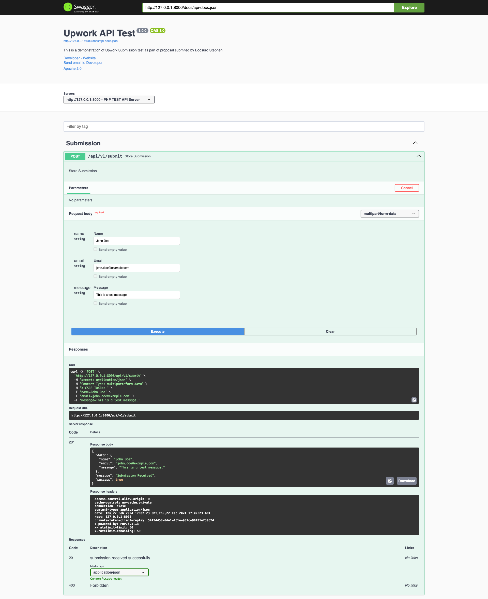
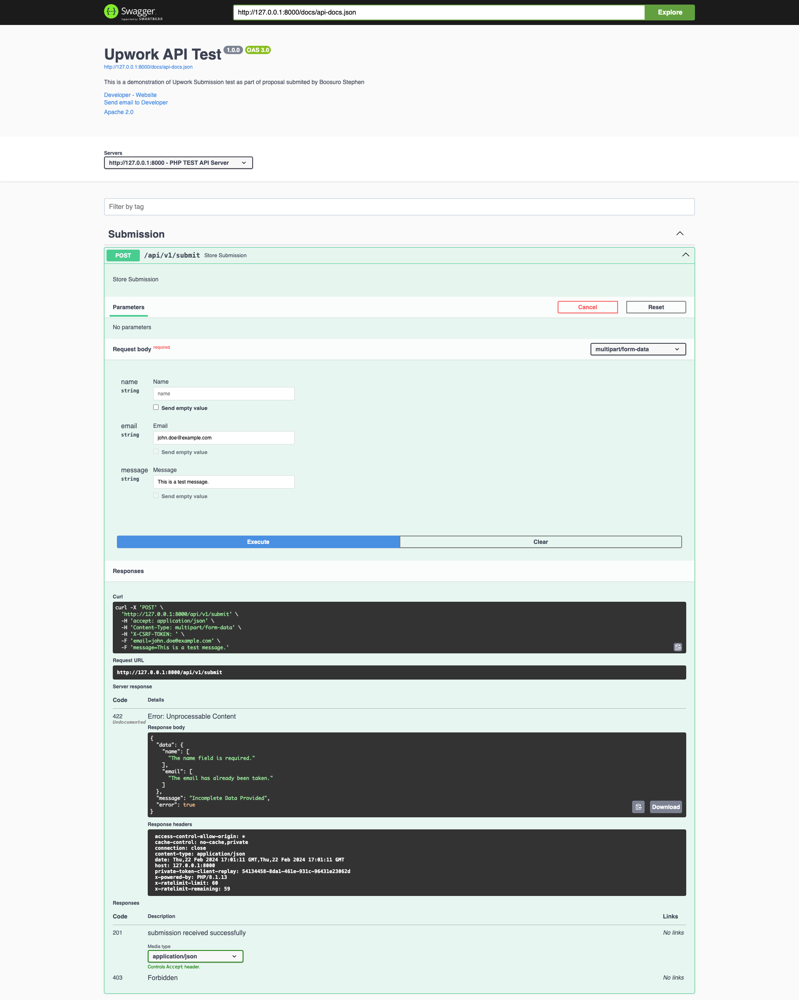

# <p align="center"> Upwork Laravel API Test</p>

#### <p align="center"> API Endpoint Documentation with Swagger </p>

# 

## <p align="center"> Endpoint Validation Check</p>

# 


## Developed with Laravel 10 and PHP 8.1

# How to Setup

1. Open your terminal and Clone the repository

```
   git clone https://github.com/boosuro/upwork_api_test.git
```

2. Switch to the repo folder

```
    cd upwork_api_test
```

3. Install all the dependencies using composer

```
    composer install
```
4. Copy the example env file and make the required configuration changes in the .env file like Database Connection details

```
    cp .env.example .env
```

5. Generate a new application key

```
    php artisan key:generate
```

6. Run the database migrations (**Set the database connection in .env before migrating**)

```
    php artisan migrate
```

7. Start the local development server

```
    php artisan serve
```

8. Start the queue worker in new terminal tab to process the jobs that will be dispatched

```
    php artisan queue:work
```

9. Open another terminal tap and generate the Swagger API documentation view

```
    php artisan l5-swagger:generate
```
After running the command above the Swagger API documentation server will be accessible at http://127.0.0.1:8000/api/documentation

The whole application runs at http://127.0.0.1:8000


**Make sure you set the correct database connection information before running the migrations**

    php artisan migrate
    php artisan serve

# Swagger API Testing

The **/submit** api can now be accessed at

    http://127.0.0.1:8000/api/documentation
